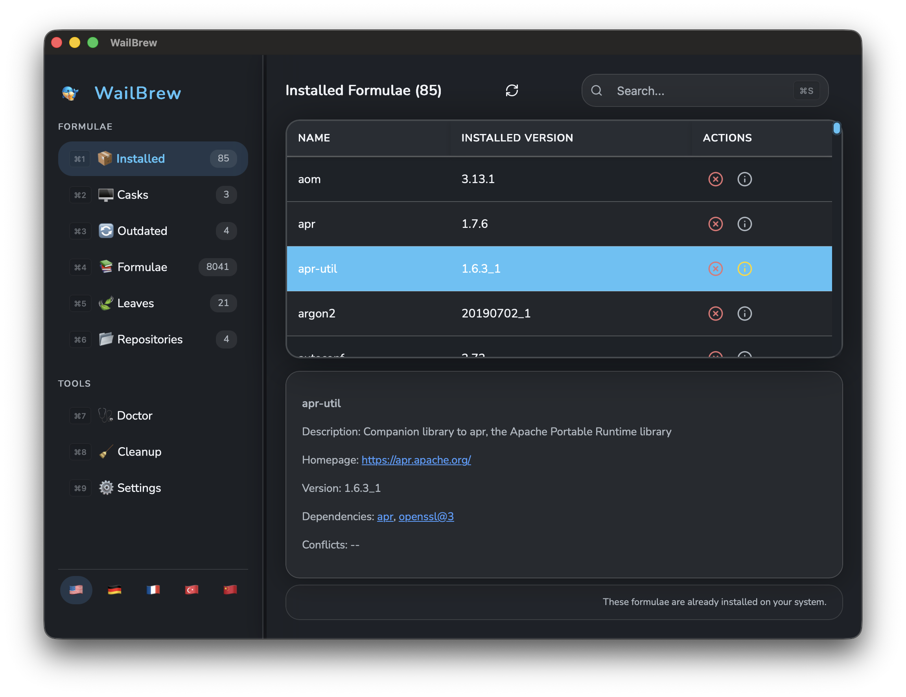

# WailBrew - Homebrew GUI Manager

[](https://github.com/wickenico/WailBrew/releases/latest)
[](https://github.com/wickenico/WailBrew/releases)

## 🍺 About

WailBrew is a modern and intuitive way to manage Homebrew on macOS! It provides a clean graphical interface that makes package management accessible to everyone. From the WailBrew UI, you can:

- View and manage installed formulas and casks
- Search through packages with instant filtering
- Install, uninstall, and upgrade packages
- Check for outdated packages and update them individually or all at once
- View detailed package information including dependencies and conflicts
- Manage Homebrew repositories (tap/untap)

WailBrew was inspired by [Cakebrew](https://www.cakebrew.com/), bringing modern UI design and enhanced functionality to Homebrew package management. Built with [Wails](https://wails.io), Go, and React, it combines native performance with a beautiful, responsive interface.

Requests, Questions, Troubleshooting? => [r/WailBrew](https://www.reddit.com/r/WailBrew)

## 📥 Installation

📦 **Installation via Homebrew (recommended):**

```bash
brew tap wickenico/wailbrew
brew install --cask wailbrew
```

**[Download Latest Version](https://github.com/wickenico/WailBrew/releases/latest)** 

## 📸 Screenshots



## 🌍 Localizations

WailBrew supports multiple languages! As of now, the following languages are supported:

- 🇺🇸 English  
- 🇩🇪 German  
- 🇫🇷 French  
- 🇹🇷 Turkish  
- 🇨🇳 Chinese (Simplified)  

If you wish to contribute by translating WailBrew to your language, feel free to [open a Pull Request](https://github.com/wickenico/WailBrew/pulls) or [create an Issue](https://github.com/wickenico/WailBrew/issues).

## 📰 Mentioned

- <a href="https://vvmac.com/wordpress_b/wailbrew-pare-homebrew-dune-interface-graphique/" target="_blank" rel="noopener noreferrer">VVMac</a>
- <a href="https://softwareontheweb.com/product/wailbrew" target="_blank" rel="noopener noreferrer">Software on the web</a>
- <a href="https://madewithreactjs.com/wailbrew" target="_blank" rel="noopener noreferrer">Made with ReactJS</a>
- <a href="https://tom-doerr.github.io/repo_posts/" target="_blank" rel="noopener noreferrer">Tom Doerr Repository Showcase</a>
- <a href="https://alternativeto.net/software/wailbrew/about/" target="_blank" rel="noopener noreferrer">AlternativeTo</a>

## 🚀 Installation & Setup
### Prerequisites
#### For Users
- macOS with Apple Silicon (not tested on Intel)
- Homebrew must be installed

#### For Developers
If you want to build WailBrew from source, you'll need:

- **macOS** with Apple Silicon (not tested on Intel)

- **Homebrew** - Install with:
  ```bash
  /bin/bash -c "$(curl -fsSL https://raw.githubusercontent.com/Homebrew/install/HEAD/install.sh)"
  ```

- **Go** (version 1.25 or higher) - Install with Homebrew:
  ```bash
  brew install go
  ```

- **Node.js** (for frontend development) - Install with Homebrew:
  ```bash
  brew install node
  ```

- **pnpm** (package manager) - Install with npm:
  ```bash
  npm install -g pnpm
  ```

- **Wails CLI** - Install with:
  ```bash
  go install github.com/wailsapp/wails/v2/cmd/wails@latest
  ```
  Make sure `~/go/bin` is in your PATH.

### Development Setup
``` bash
# Clone the repository
git clone https://github.com/wickenico/WailBrew.git
cd WailBrew

# Install Go dependencies
go mod download

# Install frontend dependencies
cd frontend && pnpm install

# Start the app in development mode
cd .. && make dev
# or alternatively: wails dev
```
### Production Build
``` bash
  wails build

# The built app will be in the build/bin/ directory
```

**Note**: Use `make` for production builds as it automatically reads the version from `frontend/package.json` and embeds it in the binary. This ensures the About dialog displays the correct version in production.

### Additional Make Commands
``` bash
make dev     # Start development server
make clean   # Clean build directory
make install # Build and install to /Applications
```

## 🛠️ Development

### Contributing
1. Fork the repository
2. Create a feature branch
3. Commit your changes
4. Push to the branch
5. Create a Pull Request

### Live Development

To run in live development mode, run `wails dev` in the project directory. This will run a Vite development
server that will provide very fast hot reload of your frontend changes. If you want to develop in a browser
and have access to your Go methods, there is also a dev server that runs on http://localhost:34115. Connect
to this in your browser, and you can call your Go code from devtools.

## 📝 License
This project is licensed under the MIT License. See [LICENSE](LICENSE) for details.
## 🐛 Troubleshooting
### Common Issues
- **Homebrew not found**: Ensure Homebrew is correctly installed
- **Permission errors**: May need to run the app with appropriate permissions
- **Slow performance**: Close other resource-intensive applications

### Support
- Create an issue on GitHub for bugs or feature requests
- Check existing issues before creating new ones

## 🏆 Acknowledgments
- Wails community for the framework: https://wails.io
- Cakebrew as inspiration: https://www.cakebrew.com/

**WailBrew** makes Homebrew management simple and accessible for all macOS users. Try it out and streamline your package management workflow!
